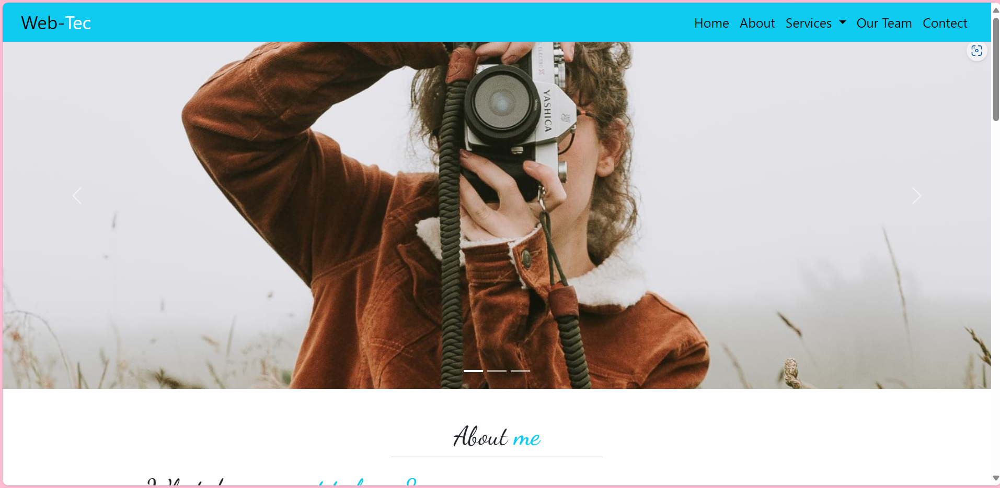

# WebTech Website

A fully responsive simple website built using **HTML** and **CSS**.

## 🖼️ Preview

> (Make sure to upload your preview image as `preview.png` in the project root.)

## How to Run

1. Download or clone the repository.
2. Open the `index.html` file in your web browser.

No installation or server needed — it runs directly in the browser! 🚀

## Tech Stack

- HTML5
- CSS3 (Responsive Design)
